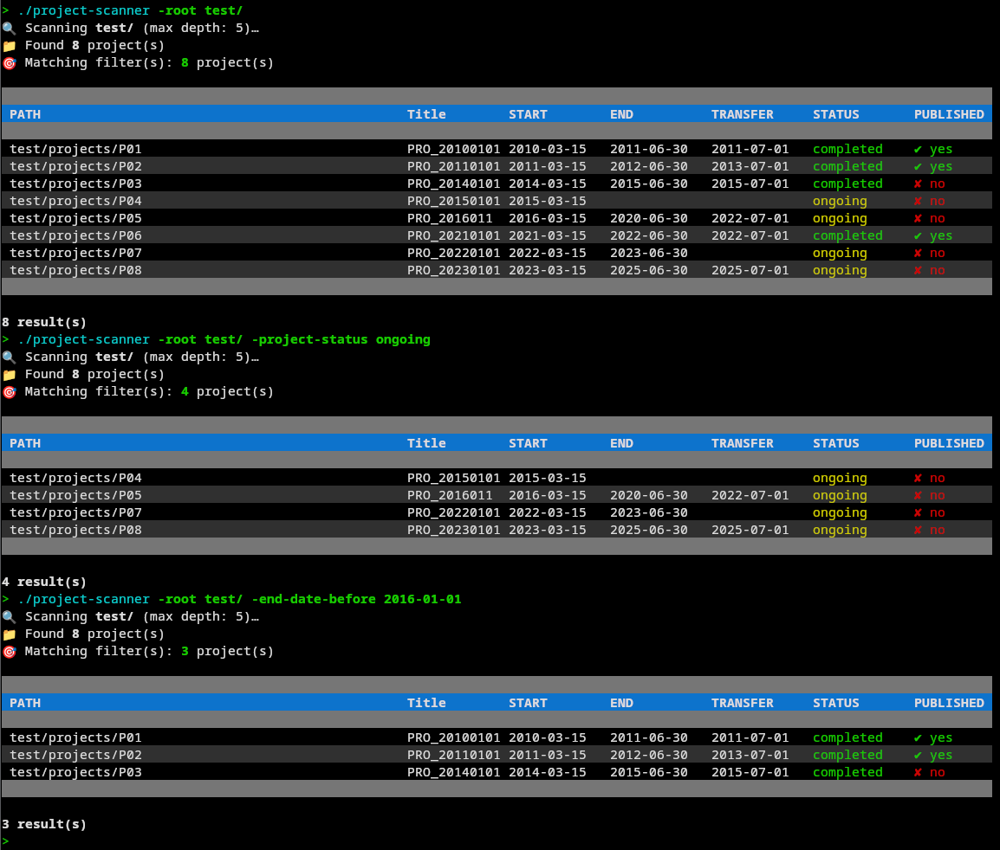

# project-scanner

A command-line tool that recursively scans a directory tree for `_readme.json` files, filters the results, and displays them as a coloured table in the terminal.

All columns and filters are **driven by `config.json`** — no code changes are needed to add, remove, or rename fields.

---

## Features

- Recursive directory scan with configurable depth
- Dynamic CLI filters generated automatically from `config.json`
- Colour-coded terminal table (alternating rows, status highlighting)
- Three filter modes: exact match, substring search, date range
- Graceful error handling — bad or unreadable files are skipped with a warning
- Auto-generates a default `config.json` if none is found

---
## ScreenShot



---
## Project structure

```
project-scanner/
├── main.go          # Entry point — static flags + dynamic flags from config
├── go.mod
├── config.json      # Field configuration (filters + table columns)
└── src/
    ├── config.go    # Config loading, FieldConfig and AppConfig types
    ├── models.go    # Project / ProjectReadme types, dynamic field access
    ├── scanner.go   # Recursive filesystem scan
    ├── filters.go   # Filter logic (FilterSet, Apply)
    └── display.go   # Terminal table rendering
```

---

## Requirements
- Statically compiled, nothing to install
- Go 1.21 or later to compile
- No external dependencies (standard library only)

---

## Build

```bash
git clone <repo-url>
cd project-scanner
go build -o project-scanner .
```

---

## Expected `_readme.json` format

Each project folder must contain a file named `_readme.json` (or any other name set via `-filename`). Fields are flexible — any key present in the file can be declared in `config.json`.

Example:

```json
{
  "Start_Date": "2023-06-01",
  "End_Date": "2024-12-31",
  "Project_status": "completed",
  "Project_published": true,
  "All_Data_transfered": "2025-01-15",
  "Dataset_title": "My dataset"
}
```

---

## Usage

```
./project-scanner [options]
```

### Static flags

| Flag | Default | Description |
|------|---------|-------------|
| `-root <path>` | `.` | Root directory to scan |
| `-depth <n>` | `5` | Maximum folder depth (`0` = root only) |
| `-config <path>` | `config.json` | Path to the JSON configuration file |
| `-filename <name>` | `_readme.json` | Name of the metadata file to look for |
| `-h` | — | Print help and exit |

### Dynamic filter flags

Filter flags are **generated at runtime** from `config.json`. The flag name is derived from the field's `json_key`: lowercased, underscores replaced by hyphens.

| `filter` value | Flags generated | Example |
|----------------|----------------|---------|
| `"date_range"` | `-<slug>-before` and `-<slug>-after` | `-end-date-before 2025-01-01` |
| `"exact"` | `-<slug> <value>` | `-project-status completed` |
| `"contains"` | `-<slug> <value>` | `-dataset-title survey` |
| `"none"` | *(none)* | — |

### Examples

```bash
# Scan the ./data directory
./project-scanner -root ./data

# Limit scan depth to 3 levels
./project-scanner -root ./data -depth 3

# Use an alternative config file
./project-scanner -root ./data -config configs/minimal.json

# Use a custom metadata filename
./project-scanner -root ./data -filename project.json

# Filter by status (exact match)
./project-scanner -root ./data -project-status ongoing

# Filter by published flag
./project-scanner -root ./data -project-published false

# Filter by date range
./project-scanner -root ./data -end-date-before 2025-01-01
./project-scanner -root ./data -end-date-after 2023-01-01

# Filter by substring
./project-scanner -root ./data -dataset-title climate

# Combine multiple filters
./project-scanner -root ./data -project-status completed -end-date-after 2023-01-01 -project-published true
```

---

## Configuration (`config.json`)

The configuration file controls which fields are shown as table columns and which can be filtered from the CLI.

```json
{
  "fields": [
    {
      "json_key":      "End_Date",
      "label":         "END",
      "type":          "date",
      "filter":        "date_range",
      "show_in_table": true,
      "col_width":     12
    },
    {
      "json_key":      "Project_status",
      "label":         "STATUS",
      "type":          "string",
      "filter":        "exact",
      "show_in_table": true,
      "col_width":     12
    },
    {
      "json_key":      "Dataset_title",
      "label":         "TITLE",
      "type":          "string",
      "filter":        "contains",
      "show_in_table": true,
      "col_width":     30
    }
  ]
}
```

### Field properties

| Property | Type | Description |
|----------|------|-------------|
| `json_key` | string | Exact key name in `_readme.json` |
| `label` | string | Column header displayed in the table |
| `type` | string | Value type: `"date"`, `"string"`, or `"bool"` |
| `filter` | string | Filter mode (see below) |
| `show_in_table` | bool | Whether this field appears as a column |
| `col_width` | int | Column width in characters |

### Filter modes

| Value | Behaviour |
|-------|-----------|
| `"none"` | Field is not filterable |
| `"exact"` | Case-insensitive equality match |
| `"contains"` | Case-insensitive substring match |
| `"date_range"` | ISO date comparison (`YYYY-MM-DD`) |

### Adding a new field

1. Make sure the key exists in your `_readme.json` files.
2. Add an entry to the `fields` array in `config.json`.
3. Restart the binary — no recompilation needed.

If `config.json` is missing when the program starts, a default configuration file is written to disk automatically.

---

## Error handling

| Situation | Behaviour |
|-----------|-----------|
| Unreadable directory | Skipped with a `⚠` warning |
| Malformed `_readme.json` | Skipped with a `⚠` warning |
| Missing `_readme.json` | Folder is silently ignored |
| Missing `config.json` | Default config is written and used |
| `-h` / `--help` flag | Usage is printed, exits with code `0` |
| Invalid flag | Exits with code `2` |

---

## License

GNU GPL — © Frédéric Pont
